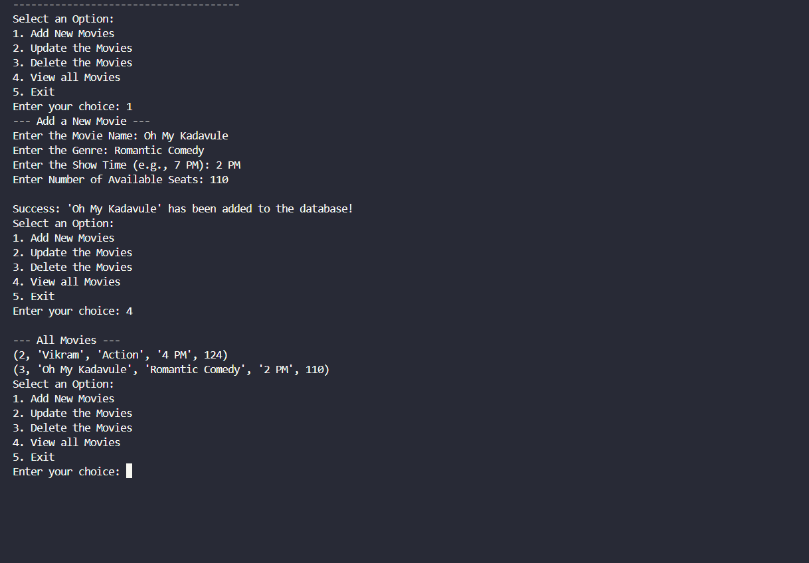
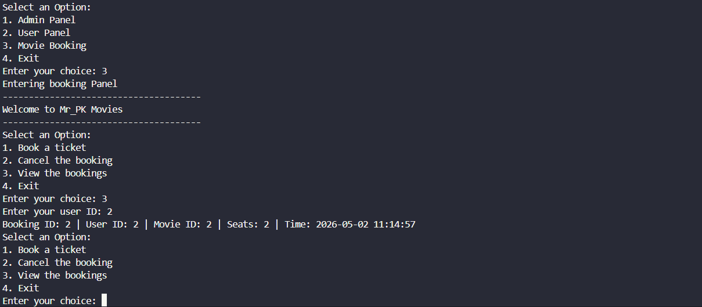

# 🎬 Ticket Booking System — Console Level

A console-based Movie Ticket Booking System built with **Python** and **SQLite**. Designed with a clean role-based menu architecture for Admins, Users, and direct Movie Booking — all from the terminal.

---

## 📖 About the Project

The **Ticket Booking System (Console Level)** is a fully functional, terminal-driven application that simulates a real-world movie ticket booking experience. It is built entirely in Python without any external libraries, using Python's built-in `sqlite3` module to persist data across sessions.

The system is divided into **three independent panels**:

- 🔐 **Admin Panel** — For theatre managers to manage the movie catalog (add, update, delete, and view movies).
- 👤 **User Panel** — For customers to register and manage their accounts.
- 🎟️ **Movie Booking Panel** — For booking and cancelling tickets, and viewing booking history.

Each panel is accessed from a central main menu, making the system modular and easy to extend. All data — movies, users, and bookings — is stored in a local SQLite database, so records persist even after the program exits.

This project is ideal for beginners learning Python, database integration (CRUD operations), and how to architect a multi-module console application.

---

## 📸 Screenshots

### 🎬 Admin Panel — Adding & Viewing Movies

> The admin can add a new movie by entering its name, genre, show time, and available seats. Once added, the movie is stored in the SQLite database and can be viewed instantly.



```
--- Add a New Movie ---
Enter the Movie Name: Oh My Kadavule
Enter the Genre: Romantic Comedy
Enter the Show Time (e.g., 7 PM): 2 PM
Enter Number of Available Seats: 110

Success: 'Oh My Kadavule' has been added to the database!

--- All Movies ---
(2, 'Vikram', 'Action', '4 PM', 124)
(3, 'Oh My Kadavule', 'Romantic Comedy', '2 PM', 110)
```

---

### 🎟️ Movie Booking Panel — Viewing Bookings

> Users can enter their User ID to view all their past bookings, including the Booking ID, Movie ID, number of seats booked, and the exact timestamp of the booking.



```
Booking ID: 2 | User ID: 2 | Movie ID: 2 | Seats: 2 | Time: 2026-05-02 11:14:57
```

> 📁 **Note:** To display images on GitHub, create a `screenshots/` folder in the root of your repo and upload your two screenshots as `admin_panel.png` and `booking_panel.png`.

---

## ✨ Features

### 🔐 Admin Panel
- Add new movies with name, genre, show time, and seat count
- Update existing movie details
- Delete movies from the database
- View the complete list of all available movies

### 👤 User Panel
- Register new users
- Login with existing credentials
- Manage user accounts

### 🎟️ Movie Booking Panel
- Book tickets for any available movie
- Cancel an existing booking
- View all bookings filtered by User ID
- Automatic timestamping on every booking

---

## 🛠️ Tech Stack

| Component  | Technology          |
|------------|---------------------|
| Language   | Python 3.x          |
| Database   | SQLite3 (built-in)  |
| Interface  | Console / Terminal  |

---

## 🚀 Getting Started

### Prerequisites
- Python 3.x installed on your system

### Installation

1. **Clone the repository**
   ```bash
   git clone https://github.com/ThePremkumar/Ticket-Booking-System-Console-Level.git
   cd Ticket-Booking-System-Console-Level
   ```

2. **Run the application**
   ```bash
   python main.py
   ```

> ✅ No external dependencies required — uses Python's built-in `sqlite3` module only.

---

## 📂 Project Structure

```
Ticket-Booking-System-Console-Level/
│
├── main.py          # Entry point — main menu (Admin / User / Booking)
├── admin.py         # Admin panel logic (Add, Update, Delete, View movies)
├── user.py          # User panel logic (Register, Login)
├── booking.py       # Booking panel logic (Book, Cancel, View bookings)
├── database.py      # SQLite database connection and table setup
├── screenshots/     # Screenshots used in README
│   ├── admin_panel.png
│   └── booking_panel.png
└── README.md
```

---

## 🗺️ How It Works

```
Main Menu
├── 1. Admin Panel
│   ├── Add New Movies
│   ├── Update the Movies
│   ├── Delete the Movies
│   └── View all Movies
│
├── 2. User Panel
│   ├── Register
│   └── Login
│
├── 3. Movie Booking
│   ├── Book a Ticket
│   ├── Cancel the Booking
│   └── View the Bookings
│
└── 4. Exit
```

**Flow:**
1. On launch, the user is presented with the **Main Menu**.
2. Selecting **Admin Panel** opens movie management — add, update, delete, or view movies in the database.
3. Selecting **User Panel** allows new users to register or existing users to log in.
4. Selecting **Movie Booking** lets any user book tickets, cancel bookings, or view their full booking history by entering their User ID.
5. All actions immediately reflect in the SQLite database and persist across sessions.

---

## 💾 Database Schema

**Movies Table**
| Column          | Type                  |
|-----------------|-----------------------|
| id              | INTEGER (Primary Key) |
| name            | TEXT                  |
| genre           | TEXT                  |
| show_time       | TEXT                  |
| available_seats | INTEGER               |

**Users Table**
| Column   | Type                  |
|----------|-----------------------|
| id       | INTEGER (Primary Key) |
| username | TEXT                  |
| password | TEXT                  |

**Bookings Table**
| Column       | Type                  |
|--------------|-----------------------|
| id           | INTEGER (Primary Key) |
| user_id      | INTEGER (Foreign Key) |
| movie_id     | INTEGER (Foreign Key) |
| seats        | INTEGER               |
| booking_time | TIMESTAMP             |

---

## 🤝 Contributing

Contributions are welcome! Feel free to open issues or submit pull requests.

1. Fork the repository
2. Create your feature branch (`git checkout -b feature/YourFeature`)
3. Commit your changes (`git commit -m 'Add some feature'`)
4. Push to the branch (`git push origin feature/YourFeature`)
5. Open a Pull Request

---

## 👨‍💻 Author

**Premkumar** — [@ThePremkumar](https://github.com/ThePremkumar)

---

## 📄 License

This project is open source and available under the [MIT License](LICENSE).

---

> *"Simple, clean, and functional — console apps never go out of style."*
